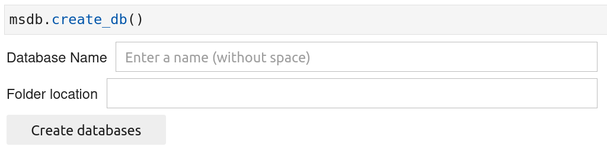

The functions provided by the *msdb* package only work on an instance of a `DB` class. The creation of an instance of a `DB` class is a two-steps procedure and is described below:

## 1. **Create the database files**

In this step, you will create the database files inside a given folder on your local computer. You will need to pass in two values:

1. The name of your database.  

2. The absolute path of the folder on your local computer where the database files will be created. 


```python
import msdb
```

```python
# When running this command, ipywidget objects will appear (see figure below)
# inside which you will be able to pass in information
msdb.create_db()
```


{: .img-Large align=left }
/// caption
Ipywidgets to be filled when creating the databases files
///


Once you have filled the ipywidgets (as illustrated below), you can click on the button 'Create databases' which will automatically create the [databases files](https://g-patin.github.io/msdb/databases-files/) inside the designated folder.

{: .img-Large align=left }
/// caption
Ipywidgets filled with the requested info
///


## 2. **Create DB class instance**

Create the instance using the name of the database.

```python
db = msdb.DB(db_name='test')
db
```
<div class="output-area">
<pre>
DB data class
</pre>
</div>

