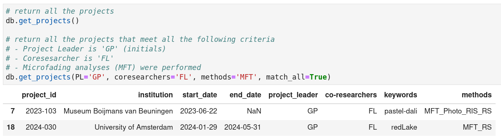
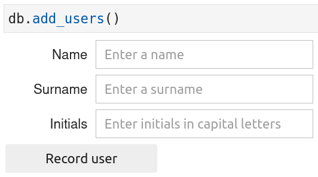
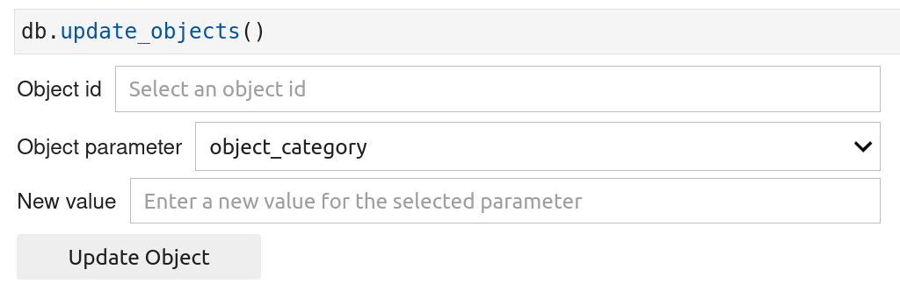
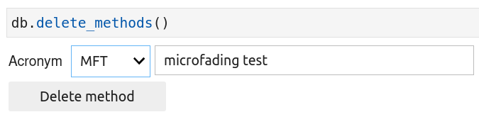

In this section, you will learn how to manipulate the databases files. Four types of operations on the files are provided by the `msdb` package and are described in the following paragraphs:

1. **Read info** : retrieve or get the content stored inside the databases files

2. **Add info** : add new content inside the databases files

3. **Update info** : modify existing content stored inside the databases files

4. **Delete info** : delete the content stored inside the databases files


These operations can be accessed through python functions that can only be used on an instance of a `DB` class. In other words, you will need to create an instance of the `DB` class (see [create instance class](https://g-patin.github.io/msdb/create-DB-class-instance/)). 


```python
import msdb

# Create an instance of the DB class
# I previously created a database called "test" with corresponding databases
# files on which the operations mentioned above can be performed

db = msdb.DB(db_name='test')
db
```

<div class="output-area">
<pre>
DB class - name  = test - folder = /home/johhn/Documents/databases
</pre>
</div>


## 1. **Get / read info**

To retrieve the content stored inside the databases files, use the functions that start with the word '**get**'. They are 12 *get* functions for which a short description is provided in Table 1.

&nbsp;

Table 1. Description of the *get* functions.

| <div style="width:205px">Function names</div> | <div style="width:250px">Description</div>
| :--------| :---------
|get_creators | Get the name and surname of persons that created the objects analyzed
|get_devices | Get information about the analytical devices used to analyze objects
|get_institutions | Get information about the institution performing analyses
|get_lamps | Get information about the lamps used to perform analyses
|get_materials | Get a list of materials found in objects
|get_methods | Get information about the analytical methods used to investigate objects
|get_objects | Get the information about the objects analyzed
|get_projects  | Get information about the projects within which objects are analyzed
|get_techniques  | Get a list of techniques used to create objects
|get_types | Get a list of general object types
|get_users | Get the name, surname, and initials of persons performing the analyses
|get_white_standards | Get information about the white standards used for the analyses

For the time being, only two functions (`get_objects` and `get_projects`) allow for arguments to be passed in to perform queries on the returned dataframe (see figure below for an example).

{: .img-Large align=left }
/// caption
get_projects() function without and with arguments.
/// 

## 2. **Add / create info**

To add new content inside the databases files, use the functions that start with the word '**add**'. They are 12 *add* functions for which a short description is provided in Table 2.

Table 2. Description of the *add* functions.

| <div style="width:205px">Function names</div> | <div style="width:250px">Description</div>
| :--------| :---------
|add_creators | Add a new person that created the objects analyzed
|add_devices | Add a new analytical device used to analyze objects
|add_institutions | Add a new institution performing analyses
|add_lamps | Add a new lamp used to perform analyses
|add_materials | Add a new material found in objects
|add_methods | Add a new analytical method to investigate objects
|add_objects | Add a new objects to be analyzed
|add_projects  | Add a new project within which objects are analyzed
|add_techniques  | Add a new technique used to create objects
|add_types | Add a new type of objects
|add_users | Add a new person performing the analyses
|add_white_standards | Add a new white standard used for the analyses

All the *add* functions return ipywidgets inside which you can enter the requested info before saving them by clicking on the 'record' button (see figure below for an example).

{: .img-small align=left }
/// caption
add_users() function.
/// 

## 3. **Update info**

For the time being, one can only update the content of the two csv files (objects_info.csv and projects_info.csv), using the functions `update_objects()` and `update_projects()` respectively. These two functions works similarly and the way to use them is described below. There are two ways you can use these functions : with or with ipywidgets. Simply, set the parameters "widgets" fo each function to True or False to use one or the other way. 

**Method with ipywidgets**

{: .img-Large align=left }
/// caption
update_objects() function using ipywidgets.
/// 

**Method without ipywidgets**

```python
# For two projects ('2023-011' and '2023-555'), I assigned
# the value 'JD' (initials for John Doe) for the 'project_leader' column.

db.update_projects(
	column='project_leader',
	new_value='JD', 
	project_id=['2023-011', '2025-555']
)
```

## 4. **Delete info**

To delete content from the databases files, use the functions that start with the word '**delete**'. They are 12 *delete* functions for which a short description is provided in Table 4.

Table 4. Description of the *delete* functions.

| <div style="width:205px">Function names</div> | <div style="width:250px">Description</div>
| :--------| :---------
|delete_creators | Delete a person that created the objects analyzed
|delete_devices | Delete an analytical device used to analyze objects
|delete_institutions | Delete an institution performing analyses
|delete_lamps | Delete a lamp used to perform analyses
|delete_materials | Delete a material found in objects
|delete_methods | Delete am analytical method to investigate objects
|delete_objects | Delete an object to be analyzed
|delete_projects  | Delete a project within which objects are analyzed
|delete_techniques  | Delete a technique used to create objects
|delete_types | Delete a type of objects
|delete_users | Delete a person performing the analyses
|delete_white_standards | Delete a white standard used for the analyses


You can always run the *delete* function directly without passing arguments. It will always display ipywidgets allowing you to select the item(s) to be deleted and then to click on the 'delete' button to effectively remove the item(s) from the databases files (see figure below for an example). 

{: .img-medium align=left }
/// caption
delete_methods() function. In this case, the 'MFT' method will be removed.
/// 

