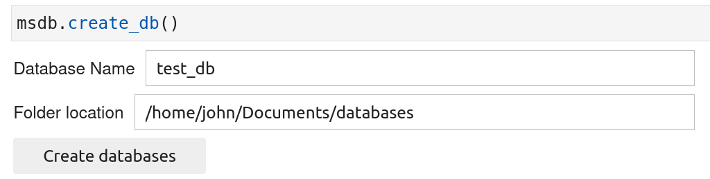
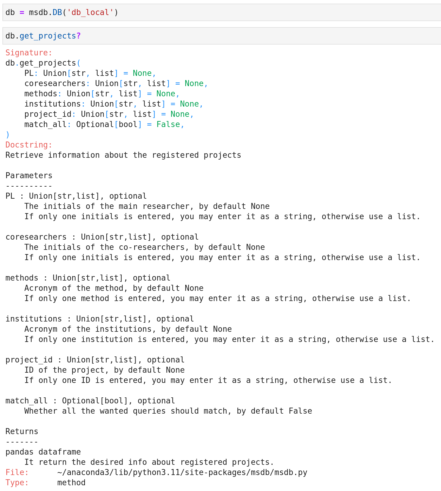

In this section, we will give you all the essential information to correctly start using the `msdb` package.

## 1. **Create databases files**

If this is the first time that you are using the `msdb` be package, you will need to create the databases files. The latter consist of txt and csv files in which you will be able to store information about the analyses of materials. Check the [databases files section](https://g-patin.github.io/msdb/databases-files/) for more information about it.

To create the databases files, follow the lines of code given below. 
	
```python
# first import the msdb package
import msdb
```

```python
# execute this line to display the ipywidgets showed below.
# fill in the database name and folder location
# click on the "Create databases" button
msdb.DB(new_db=True)
```

&nbsp;

{: .img-Large align=left }
/// caption
Ipywidgets to be filled when creating the databases files
///


{: .img-Large align=left }
/// caption
Ipywidgets filled with the databases information
///

&nbsp;


## 2. **Central role of the `DB` class**
 
Once you have created databases and registered them in the msdb config file, you will be able to create an instance of the `DB` class, passing the name of a registered database as argument (see code below). Most of the functions provided by the package can only be accessed through the `DB` class.  
&nbsp;
	
```python
import msdb
```

```python
db = msdb.DB(db_name='test')
# where 'test' is the name of a database that I previously created
```

&nbsp;
		
	
## 3. **Four keywords function: add, get, update, delete**

Once you have created an instance of the `DB` class, you can access the functions. The name of each function starts by a verb: add, get, update, or delete. Enter one of the verbs and use the auto-completion tool (`Tab` button) to display a list of available functions.

{: .img-small align=left }
/// caption
List of all the "get" functions.
///
	
All the functions can be run without passing any arguments, this behaviour will output the default values. For some functions, you have the possibility to pass in some arguments that it will enable you to adjust the output according to your needs. For example, running the function `get_projects`without any arguments will return information about all the registered projects. But you can ask the function to return only the projects that match some requirements. For instance, in the exemple illustrated below, only the projects lead by Gauthier Patin (GP) and for which microfading (MFT) and photos were performed are being returned. 

	
{: .img-Large align=left }
/// caption
Play with the argument values of functions 
///


## 4. **Use the docstrings**

Whenever you will use functions from the `msdb` package, you will always be able to access the docstrings. These contain valuable information that will help you to adequately use the functions. To open the dosctrings, you have two possibilites:

1. Write the name of a function (without parentheses) followed by a question mark (see example below).

	{: .img-Large align=left }
	/// caption
	Opening a docstring with a question mark.
	///


2. Write the name of a function (with parentheses), place the cursor inside the parentheses and press `Ctrl + Caps Lock` (see example below).

{: .img-Large align=left }
/// caption
Opening a tooltip docstring window.
///
