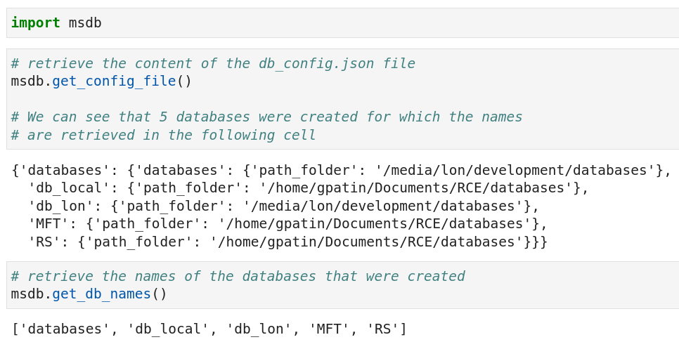

In this section, we will show you how to access the content of the db_config.json file of the `msdb` package. In the image below, you can see how to read the content of the db_config.json file.

{: .img-medium align=left }
/// caption
Retrieve the content of the db_config file.
///

