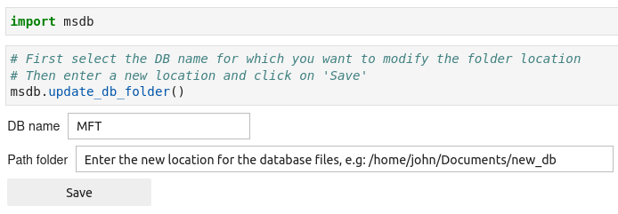
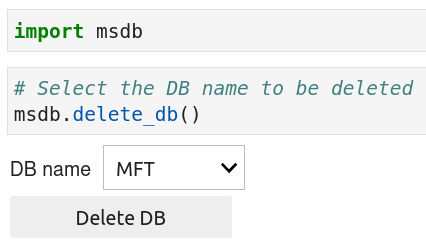

In this section, you will learn how to manage the content of the *db_config.json* file. We will show you how to:

- read content
- add content
- update content
- delete content


For a description of the json file, consult the [db_config file](https://g-patin.github.io/msdb/db_config/) section.


## 1. **Read content**

To read the content of the *db_config* file, use the following lines of code:

```python
import msdb
```

```python
# display the content of the db_config.json file
# we can see that I created two databases : 'db' and 'MFT'
msdb.get_config_file()
```

<div class="output-area">
<pre>
{'databases': {'db': {'path_folder': '/home/john/Documents/databases'},    
  'MFT': {'path_folder': '/home/john/Documents/MFT/databases'}}}
</pre>
</div>


## 2. **Add content**

There are two possibilities to add content to the *db_config* file:

1. You can either create a new database along with the txt and csv files. This will automatically register the database in the *db_config* file (see [create databases](https://g-patin.github.io/msdb/create-databases/)).

2. The databases files have already been created on your local computer and you simply want to register the database inside in the *db_config* file. In that case, you can use the `add_db_name()` function, as illustrated below.

```python
import msdb
```

```python
# This command will display two ipywidgets inside which you will be able
# to register the database name and folder location.
msdb.add_db_name()
```


## 3. **Update content**

Updating the content of the *db_config.json* file consists of changing the folder location of an existing database. To perform that operation, use the `update_db_folder()` function, as illustrated below.

{: .img-large align=left }
/// caption
Update the folder location of an existing database
///

## 4. **Delete content**

To delete a given database from the *db_config.json* file, use the `delete_db()` function, as illustrated below. It will only remove the database from *db_config.json* file. The txt and csv databases files have to delete be manually. 

{: .img-small align=left }
/// caption
Delete databases from the db_config.json file
///
